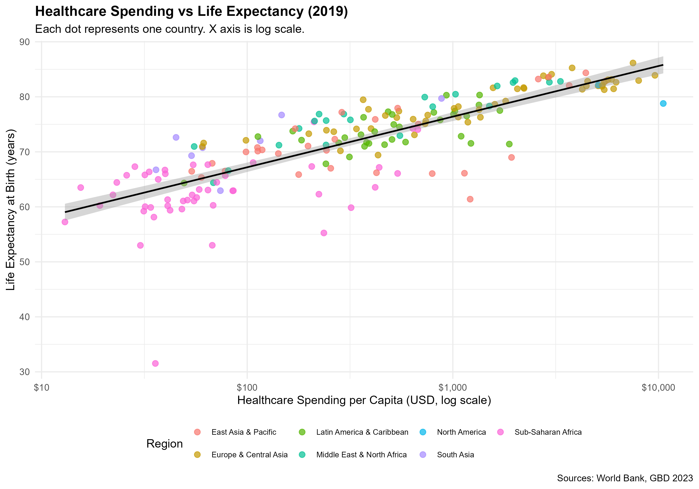
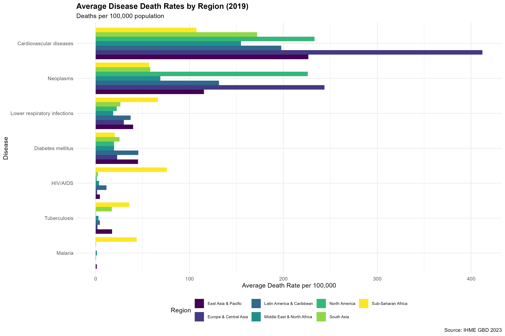
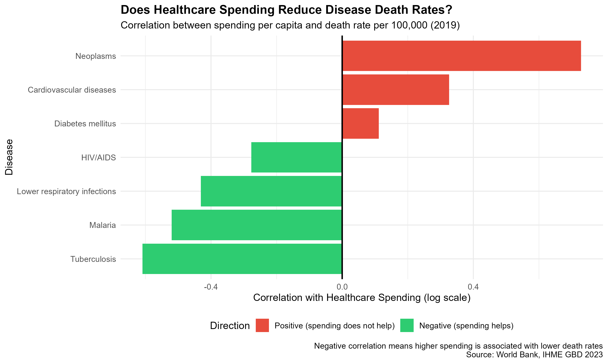
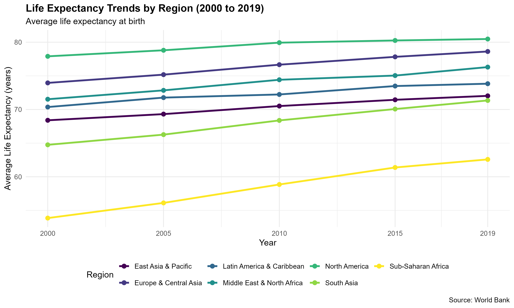
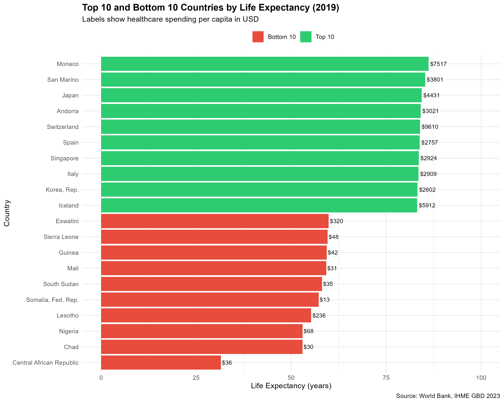

# Healthcare Investment and Global Disease Burden Analysis

An exploratory data analysis examining the relationship between 
healthcare expenditure and health outcomes across 150+ countries 
from 2000 to 2019, using R programming.

Built as an independent portfolio project, motivated by my research 
experience in the Baral Lab at Johns Hopkins University where I work 
with large-scale multi-country epidemiological datasets.

---

## Research Questions

1. Is there a relationship between healthcare spending and life expectancy?
2. Which diseases carry the highest burden across global regions?
3. Does higher spending reduce disease-specific death rates, and does 
   this differ between infectious and non-communicable diseases?
4. How has life expectancy changed across regions from 2000 to 2019?
5. What is the spending gap between highest and lowest life expectancy 
   countries?

---

## Key Findings

- **Healthcare spending is strongly associated with life expectancy** 
  globally, with the greatest gains at lower spending levels
- **Infectious diseases respond to investment** — Tuberculosis, Malaria, 
  HIV/AIDS, and lower respiratory infections all show negative correlation 
  with spending (more spending = fewer deaths)
- **Non-communicable diseases do not respond the same way** — Cancer, 
  cardiovascular disease, and diabetes show higher rates in wealthier 
  countries, driven by lifestyle and demographic factors
- **Sub-Saharan Africa made the steepest improvement** in life expectancy 
  from 2000 to 2019, likely driven by HIV/AIDS antiretroviral scale-up, 
  yet still lags all other regions by at least 10 years
- **A 500-fold spending gap exists** between the highest and lowest life 
  expectancy countries — Somalia spends $13 per capita, Switzerland $9,610

---

## Data Sources

| Dataset | Source |
|---|---|
| Healthcare expenditure per capita | World Bank |
| Life expectancy at birth | World Bank |
| Hospital beds per 1,000 people | World Bank |
| Disease-specific death rates | IHME GBD 2023 |

All datasets are publicly available and free to download.

---

## Visualisations

### 1. Healthcare Spending vs Life Expectancy


### 2. Disease Death Rates by Region


### 3. Does Spending Reduce Disease Death Rates?


### 4. Life Expectancy Trends by Region


### 5. Top and Bottom Countries by Life Expectancy


---

## How to Run

**1. Clone the repository**

git clone https://github.com/khushidesai310-lab/global-health-analysis.git
cd global-health-analysis

**2. Install required R packages**
```r
install.packages(c("tidyverse", "ggplot2", "janitor", 
                   "countrycode", "viridis", "scales", 
                   "patchwork", "knitr", "rmarkdown"))
```

**3. Run the scripts in order**
```r
source("01_load_clean.R")   # Load and clean all datasets
source("02_analysis.R")      # Generate all plots
```

**4. Knit the report**

Open `amr_analysis_report.Rmd` in RStudio and click Knit to generate 
the full HTML report.

---

## Project Structure
```
global-health-analysis/
├── data/
│   ├── IHME-GBD_2023_DATA-.csv        GBD life expectancy data
│   ├── IHME-GBD_2023_DATA--1.csv      GBD disease burden data
│   ├── API_SH.XPD.CHEX.PC.CD_.csv     Healthcare spending
│   ├── API_SP.DYN.LE00.IN_.csv        Life expectancy
│   ├── API_SH.MED.BEDS.ZS_*.csv        Hospital beds
│   └── processed/
│       ├── merged_clean.csv             Cleaned merged dataset
│       └── merged_full.csv              Full dataset with diseases
├── outputs/figures/                     All 5 PNG visualisations
├── 01_load_clean.R                      Data loading and cleaning
├── 02_analysis.R                        Analysis and visualisations
├── amr_analysis_report.Rmd              R Markdown report source
├── amr_analysis_report.html             Rendered HTML report
└── README.md
```
---

## Limitations

- This analysis shows association, not causation
- Country-level averages mask within-country inequality
- Hospital beds data had significant missing values
- Positive correlation between spending and NCDs may partly reflect 
  better diagnosis and reporting in high-income countries

---

## Tools Used

- **R** — tidyverse, ggplot2, dplyr, janitor, countrycode, viridis
- **R Markdown** — for reproducible report generation
- **Data sources** — World Bank Open Data, IHME GBD 2023

---

*Khushi Desai | MS Bioinformatics, Johns Hopkins University*  
*Motivated by research in the Baral Lab on multi-country 
epidemiological datasets*